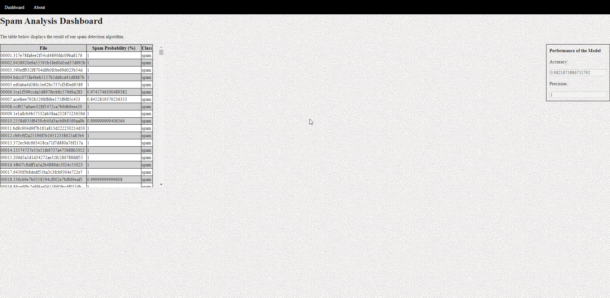

# Assignment 01 - Spam Detector
> Course: CSCI 2020U: Software Systems Development and Integration

A. The project is a spam detection ai that utilizes a unigram approach to determine whether or not a message is spam. The program will calculate probabilities based on each word’s frequency. The program will read the testing and training data files, train, and test the model. The program will return a json file with the spam probability of each message. The program will also return the accuracy and precision of the model. On the left side of the html page there is the name of the file the percentage of it being a spam and its class and on the right side of the page is the accuracy and persicion of the model. 

B. Our project used regex to eleminate strings that were not of the english dictionary and used stopwords to eleminate words that were not important to the model. For the interface of the webpage we added a background image, alternating backgroun colors for the table to add readability, and a font that was easy to read. added a top bar to flip between two pages and hovering over the buttons will change the color of the button.

C.To successfully clone and run our application:
Steps to clone application

1- get github repo link

2- Clone github repo link

3- Open up terminal/git bash

4- Navigate way too desired folder

5- Clone github repo into folder

6- Open up cloned repo in desired IDE

7- Open up settings, Build and Performance tab, Debugger, and change port to desired port.

8- Make glassfish configuration, set URL, domains, and initiate artifcats.

9- Run glassfish configuration on file

10- After glassfish server launches, navigate to html file and launch html file to desired web browser

11- end glasshfish server once finished

D. We used regex to filter out characters that are non alphabetical and non numeric. We also used regex to filter out words that are not in the english dictionary. We used a stopword list to filter out words that are not important to the model.